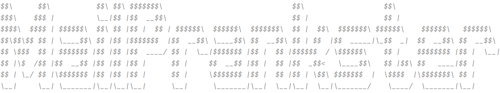
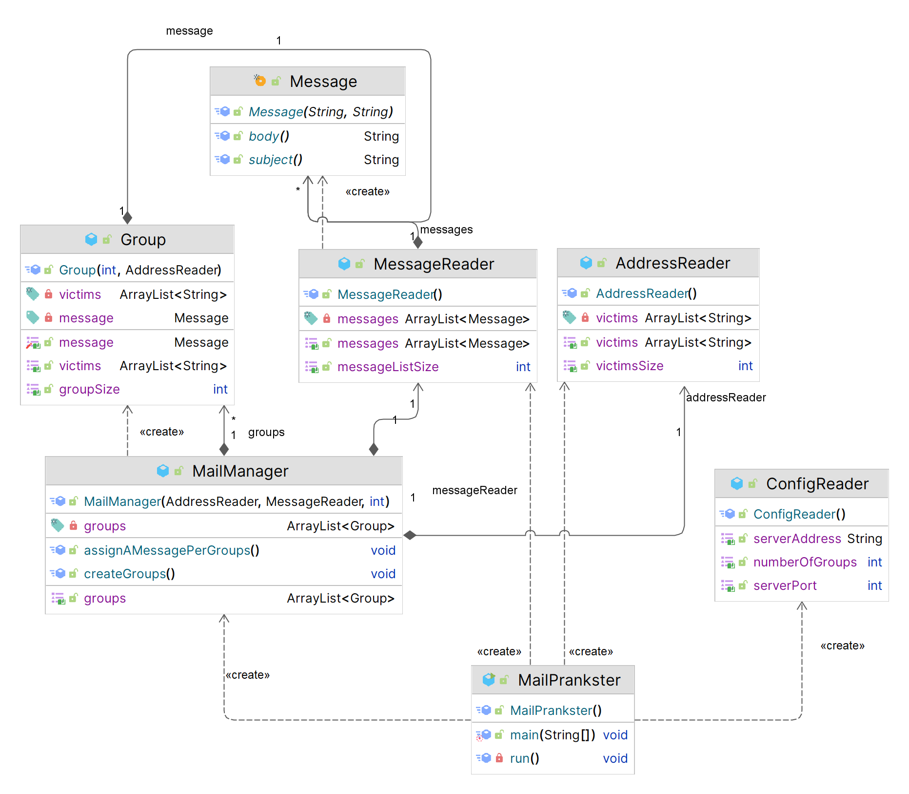

MailPrankster : a prank email sender
=============

  <picture>
    <source media="(prefers-color-scheme: dark)" srcset="figures/MailPranksterLogoDark.png">
    <source media="(prefers-color-scheme: light)" srcset="figures/MailPranksterLogoLight.png">
    
  </picture>
   
   

<h3 align="center">
    
State-of-the-art Prank email sender

</h3>

📧 MailPrankster provides an easy way to send prank emails to a (mock) SMTP server 

The main use of this program is educational purposes.

Setup
-----------

There are 3 files in the `/src/main/config` directory:

<ul>
<li>config.json</li>
<li>messages.json</li>
<li>victims.json</li>
</ul>

SMTP server
-----------

We used [MailDev](https://github.com/maildev/maildev) as a mock SMTP server.  **Do not use a real SMTP server unless you actually want to prank people**.

Make sure to run this command before running the program or the client won't be able to connect to the server.

Disclaimer: you might have to change the code a bit to make it work with a real SMTP server 

Use docker to start the server:

    docker run -d -p 1080:1080 -p 1025:1025 maildev/maildev

This provides a Web interface on localhost:1080 and a SMTP server on localhost:1025.

Class diagram
----------

Here's our class diagram
<picture>
  <source media="(prefers-color-scheme: dark)" srcset="figures/classDiagramDark.png" />
  <source media="(prefers-color-scheme: light)" srcset="figures/classDiagramLight.png" />
  
</picture>

Disclaimer
----------

MailPrankster declines all responsibility of your actions when using our app!

References
----------

* The [SMTP RFC](<https://tools.ietf.org/html/rfc5321#appendix-D>), and in particular the [example scenario](<https://tools.ietf.org/html/rfc5321#appendix-D>)
