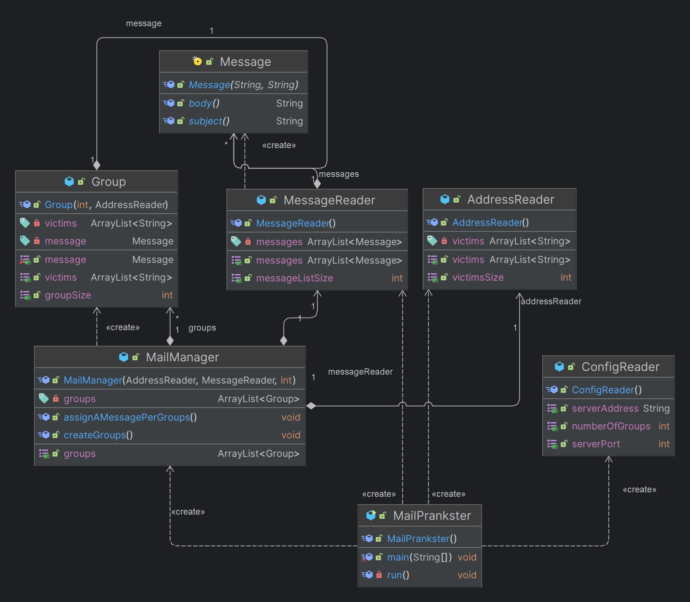

MailPrankster : a prank email sender
=============

Deliverables
------------

Your repository should contain both the source code of your Java project and your report. Your report should be a single `README.md` file, located at the root of your repository. The images should be placed in a `figures` directory.

Your report MUST include the following sections:

* **A brief description of your project**: if people exploring GitHub find your repo, without a prior knowledge of the API course, they should be able to understand what your repo is all about and whether they should look at it more closely.

* **Instructions for setting up your mock SMTP server**. The user who wants to experiment with your tool but does not really want to send pranks immediately should be able to use a mock SMTP server.

* **Clear and simple instructions for configuring your tool and running a prank campaign**. If you do a good job, an external user should be able to clone your repo, edit a couple of files and send a batch of e-mails in less than 10 minutes.

* **A description of your implementation**: document the key aspects of your code. It is a good idea to start with a **class diagram**. Decide which classes you want to show (focus on the important ones) and describe their responsibilities in text. It is also certainly a good idea to include examples of dialogues between your client and an SMTP server (maybe you also want to include some screenshots here).

References
----------

* The [SMTP RFC](<https://tools.ietf.org/html/rfc5321#appendix-D>), and in particular the [example scenario](<https://tools.ietf.org/html/rfc5321#appendix-D>)
* The [mailtrap](<https://mailtrap.io/>) online service for testing SMTP

<picture>
  <source media="(prefers-color-scheme: dark)" srcset="figures/classDiagramDark.png" />
  <source media="(prefers-color-scheme: light)" srcset="figures/classDiagramLight.png" />
  
</picture>
